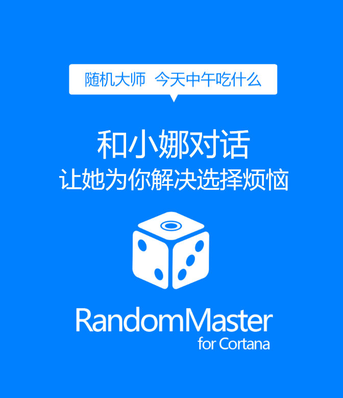

# Random Master

A project by Team Dimension built in Microsoft Campus Hackathon,
aiming to help people to make choices.

And it was our FIRST time to learn and build C# Apps :smile: ;
Enjoy it soooo much~

## Motivation

People are always confused when there are more than one choice.
*"Should I buy it?"*, *"Should I eat this?"*, *"What to eat today?"*,
*"Red, Blue or Black?"* Life is full of confusion, :sob:

Well, Random Master will help when you are feeling hard to choose.

## Features

- Cortana Integration
- Quick to Make Choices
- Chinese Natural Language Processing

## Demo

We've made them into *Office Mix* and posted the videos to *YouKu*:
- http://v.youku.com/v_show/id_XMTQxMjkyODM0NA==.html
- http://v.youku.com/v_show/id_XMTUzNTA5ODg1Ng==.html
- http://v.youku.com/v_show/id_XMTYyNjQwOTIzMg==.html
- http://v.youku.com/v_show/id_XMTYyNzk1NzU2MA==.html

## In Store

We've publish the App into Microsoft Store:
https://www.microsoft.com/zh-cn/store/apps/Random%20Master/9nblggh6hcp7

Welcome to *Download* and *Rate / Review* :smile:

